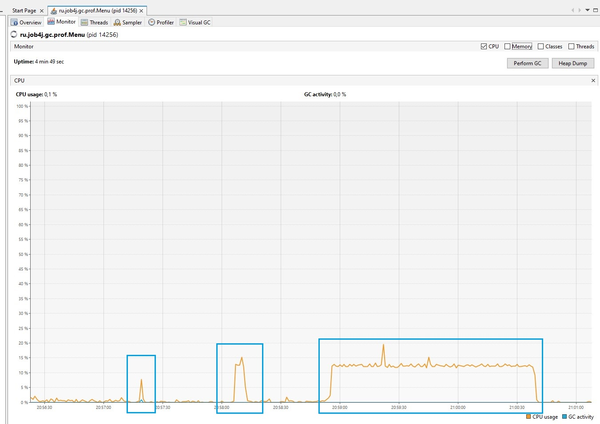
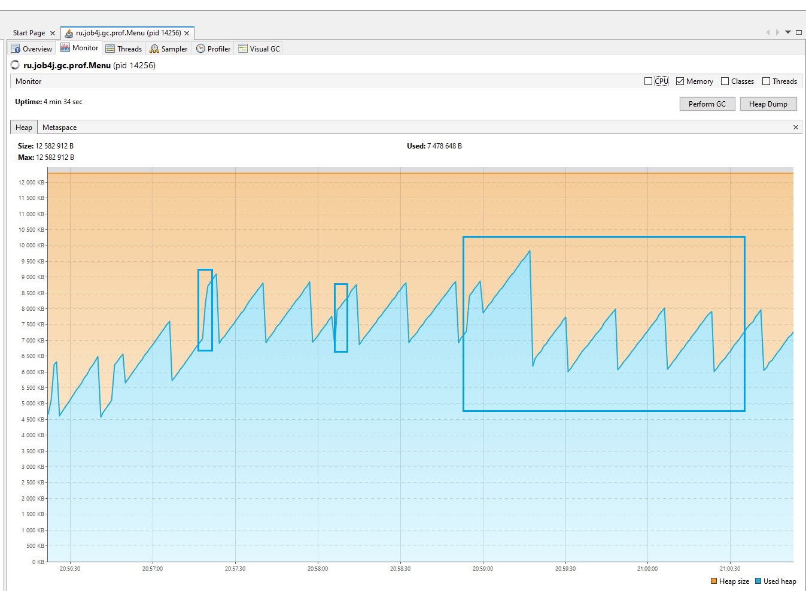
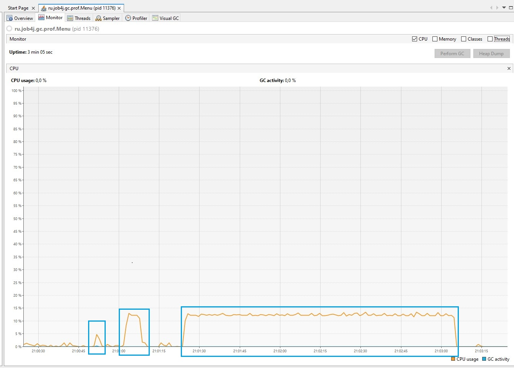
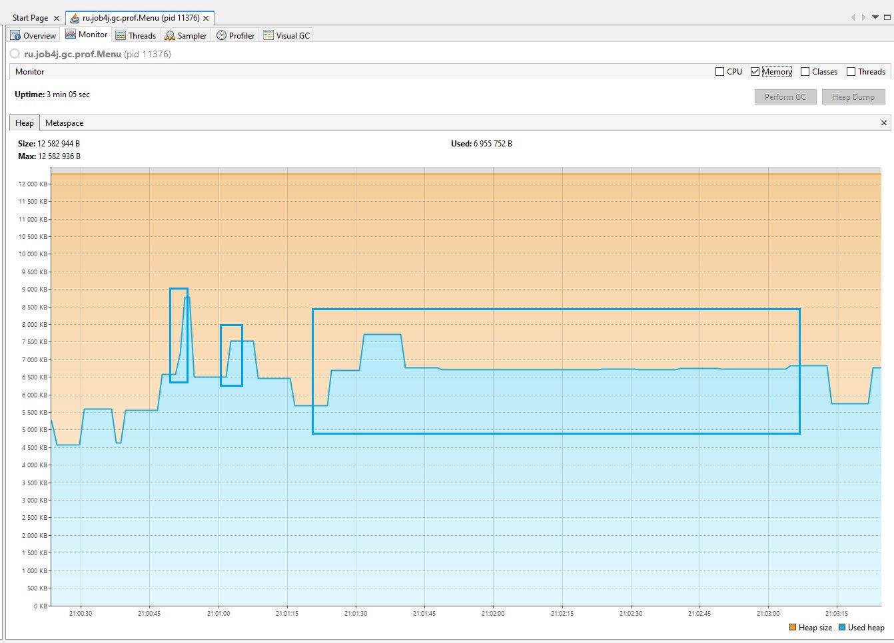
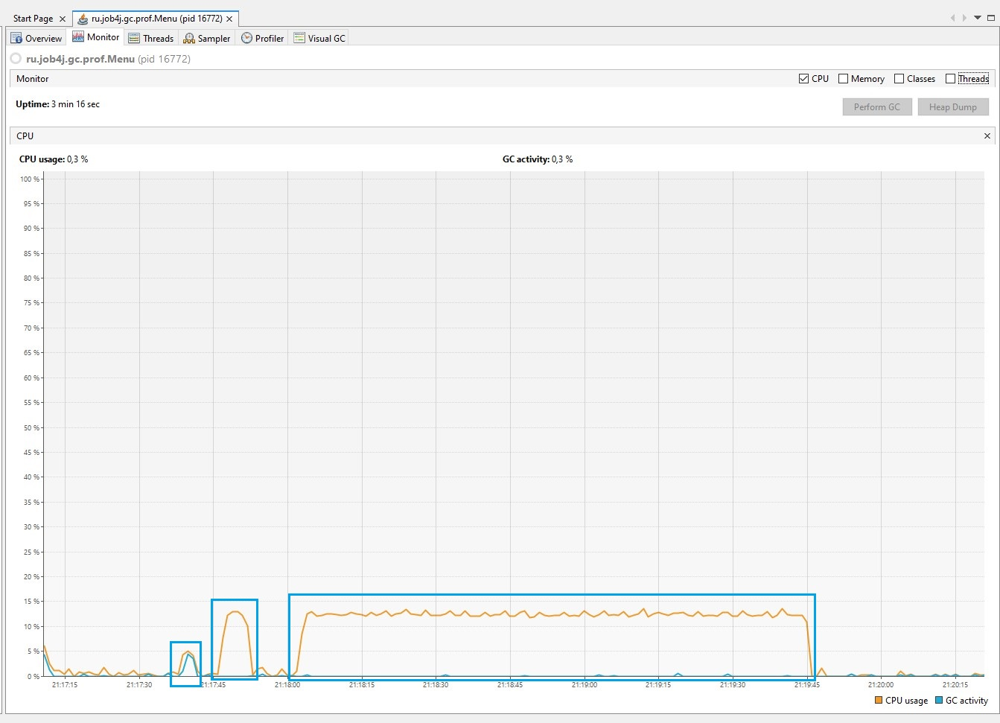
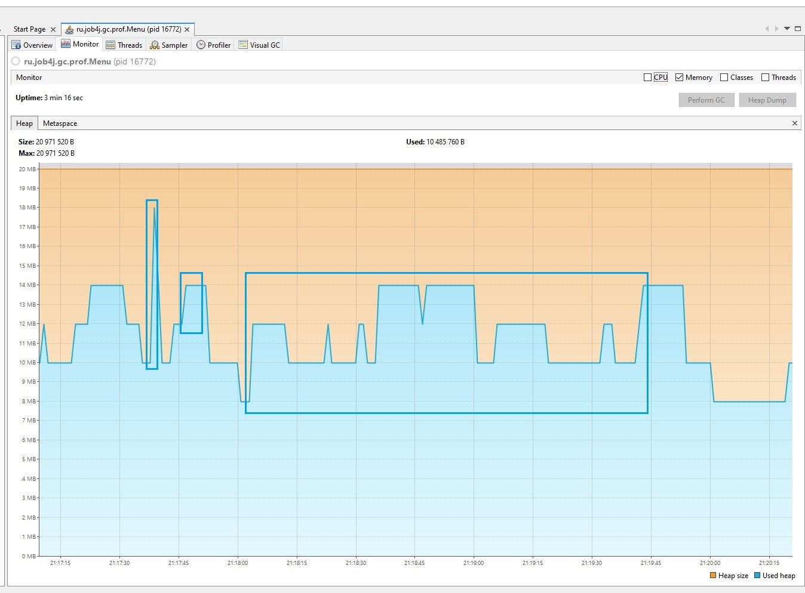

<h1>Эксперименты с различными GC</h1>

Тестируемая <a target="blank" href="https://github.com/plahotinandrei/job4j_design/src/main/java/ru/job4j/gc/prof">программа</a>.

Порядок действий при тестировании:

<ol>
    <li>Cоздание массива 250000 элементов;</li>
    <li>Выполнить сортировку слиянием;</li>
    <li>Выполнить сортировку вставками;</li>
    <li>Выполнить сортировку пузырьком;</li>
    <li>Выход.</li>
</ol>
<h3>1. Parallel GC. Размер кучи 12 мб.</h3>

Графики CPU и Heap выполнения сортировок слиянием, вставками и пузырьком соответственно:

<figure>
    
    <figcaption>CPU</figcaption>
</figure>
<figure>
    
    <figcaption>Heap</figcaption>
</figure>

Лог файл работы GC: <a target="blank" href="https://github.com/plahotinandrei/job4j_design/assets/files/parallel_log.txt">log.txt</a>

Таймкоды сортировок:

<ul>
    <li>
        MergeSort Начало сортировки - 20:57:18.70  
        MergeSort Конец сортировки - 20:57:18.90  
        MergeSort Время выполнения - 20ms
    </li>
    <li>
        InsertSort Начало сортировки - 20:58:06.01  
        InsertSort Конец сортировки - 20:58:11.44  
        InsertSort Время выполнения - 5s 43ms
    </li>
    <li>
        BubbleSort Начало сортировки - 20:58:54.92  
        BubbleSort Конец сортировки - 21:00:38.80  
        BubbleSort Время выполнения - 1m 43s 88ms
    </li>
</ul>

Наблюдения:

График Heap похож на аналогичный график при использованиии Serial GC. На графики CPU земетны пики активности во время полной сборки.

<h3>2. G1 GC. Размер кучи 12 мб.</h3>

Графики CPU и Heap выполнения сортировок слиянием, вставками и пузырьком соответственно:

<figure>
    
    <figcaption>CPU</figcaption>
</figure>
<figure>
    
    <figcaption>Heap</figcaption>
</figure>

Лог файл работы GC: <a target="blank" href="https://github.com/plahotinandrei/job4j_design/assets/files/g1_log.txt">log.txt</a>

Таймкоды сортировок:

<ul>
    <li>
        MergeSort Начало сортировки - 21:00:51.52  
        MergeSort Конец сортировки - 21:00:51.74  
        MergeSort Время выполнения - 22ms
    </li>
    <li>
        InsertSort Начало сортировки - 21:01:02.09  
        InsertSort Конец сортировки - 21:01:07.53  
        InsertSort Время выполнения - 5s 44ms
    </li>
    <li>
        BubbleSort Начало сортировки - 21:01:23.91  
        BubbleSort Конец сортировки - 21:03:04.67  
        BubbleSort Время выполнения - 1m 40s 76ms
    </li>
</ul>

Наблюдения:

    Видим меньшие перепадов и более плавный график Heap с малым количеством явных пиков.
    Это связано с тем, что G1 избегает полных сборок. Но выполняет более частые смешанные сборки, которые очиищают молодое поколение, а также ряд регионов старого поколения, которые содержат больше всего мусора.
    А так же разбиением кучи на малые регионы, которые гибко распредиляются между Eden, Survivor и Old.

<h3>3. Z GC. Размер кучи 20 мб.</h3>

Графики CPU и Heap выполнения сортировок слиянием, вставками и пузырьком соответственно:

<figure>
    
    <figcaption>CPU</figcaption>
</figure>
<figure>
    
    <figcaption>Heap</figcaption>
</figure>

Лог файл работы GC: <a target="blank" href="https://github.com/plahotinandrei/job4j_design/assets/files/zgc_log.txt">log.txt</a>

Таймкоды сортировок:

<ul>
    <li>
        MergeSort Начало сортировки - 21:17:38.59  
        MergeSort Конец сортировки - 21:17:38.75  
        MergeSort Время выполнения - 16ms
    </li>
    <li>
        InsertSort Начало сортировки - 21:17:46.29  
        InsertSort Конец сортировки - 21:17:51.71  
        InsertSort Время выполнения - 5s 42ms
    </li>
    <li>
        BubbleSort Начало сортировки - 21:18:02.20  
        BubbleSort Конец сортировки - 21:19:44.77  
        BubbleSort Время выполнения - 1m 42s 57ms
    </li>
</ul>

Наблюдения:

    Видим плавный график Heap с малым количеством явных пиков, но больший перепад по сравнению с другими GC.
    ZGC требует больше памяти для своей работы, чтобы обеспечить меньшую задержку и большую пропускную способность.

